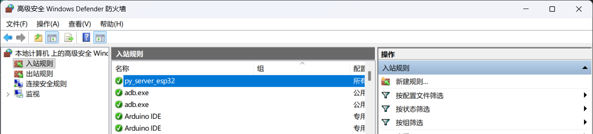

## ESP32

XIAO ESP32C3

### 官方文档

https://wiki.seeedstudio.com/XIAO_ESP32C3_Getting_Started/

Interfaces：I2C/UART/SPI

PWM/Analog Pins：11/4

### 编程环境配置

添加额外配置（开发板管理器地址）

```
https://files.seeedstudio.com/arduino/package_seeeduino_boards_index.ison
https://github.com/earlephilhower/arduino-pico/releases/download/global/package_rp2040_index.json
https://raw.githubusercontent.com/espressif/arduino-esp32/gh-pages/package_esp32_dev_index.json
```

开发板管理器中安装esp32扩展

如果使用windows开启热点，似乎需要配置入站规则



传输数据包格式：队伍编号 时间 压力/深度（如：PN01 1:51:42 UTC 9.8 kpa 1.00 meters ）
